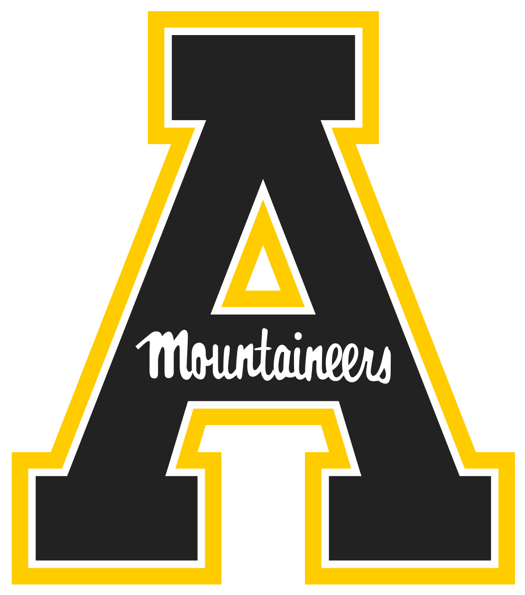

# Mary Walton, B.S.
------
[Department of Geography & Planning](http://geo.appstate.edu), Boone NC 

  
# Summary
Persuing a degree in Recreation Management and Geography and passionate about keeping the outdoors accessible and enjoying them sustainably. 
#Education
B.S. Recreation Management
Minor in Geography/GIS certification
Appalachian State University '24
Boone, NC, USA
# Work Experience 
#### Administrative Assistant 
Appalachian State University Health Promotion for Faculty and Staff 
*Jan 2023 - Present*
#### Methow Valley Backcountry Trail Team Member
Student Conservation Association & Methow Valley Trails Collaborative 
*June 2023 - August 2023*
#### Operations Staff
Ridge Haven Summer Camp 
*May 2020 - August 2022 (Seasonal)*
#### Floral Assistant
Inspired Design NC
*December 2018 - January 2020*

 
